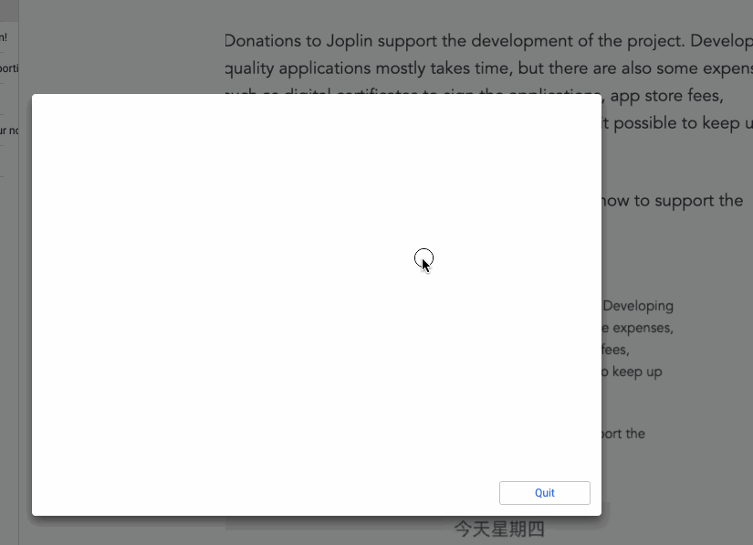
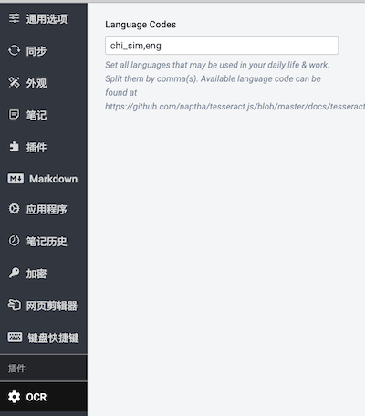
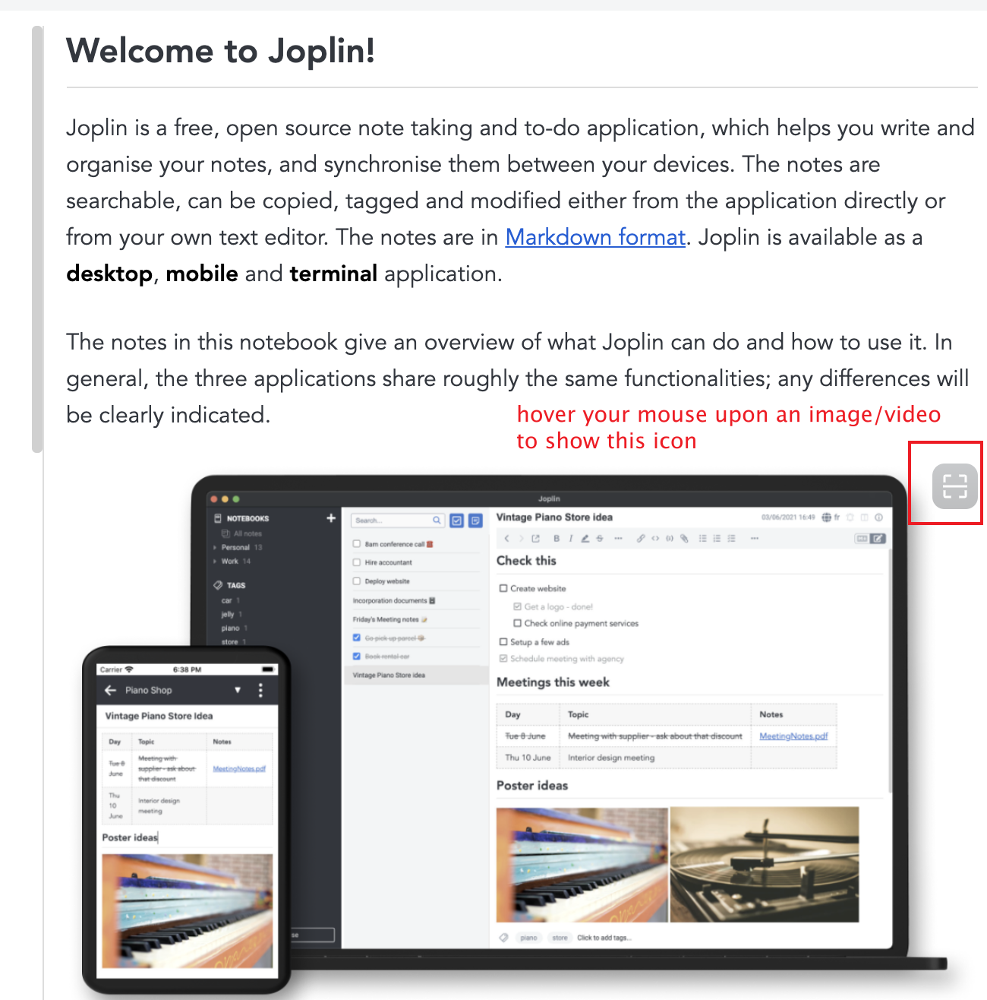

# Joplin OCR

**This plugin is still in development stage.Everything may change, but some features are available now.**

Feature & UI suggestions / bug reports are welcome!

## Features

All of them work offline, except for downloading language package(s) on first time usage

- OCR for local/remote images
- OCR for local/remote videos
- OCR for local PDFs

Auto Recognition(images only) is available:

## User Guide

Before starting using this plugin, please set the **Language codes**:

All available Language Code can be found at https://github.com/naptha/tesseract.js/blob/master/docs/tesseract_lang_list.md

In Note View Panel, click the icon on top-right corner to start OCR

